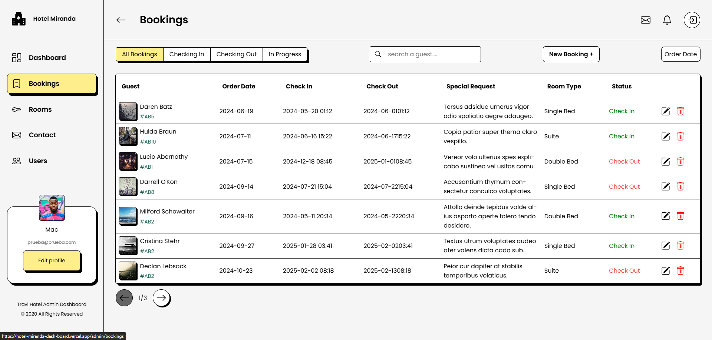

# Bienvenido a [Joselu.dev](https://joselu-portfolio.vercel.app/)!



Este es un proyecto de portfolio desarrollado con **Astro**, **TypeScript**, **React**, y **CSS**. Este repositorio muestra mi trayectoria como Desarrollador Front-end, ofreciendo una plataforma para compartir mis proyectos y avances.

---

## Instrucciones para Desarrollo

Sigue los pasos a continuación para ejecutar el proyecto en tu entorno local:

1. **Clonar el repositorio**

   ```bash
   git clone https://github.com/tu_usuario/portfolio.git
   cd portfolio
   ```

2. **Levantar la API**
   Este proyecto depende de un backend para funcionar correctamente. Asegúrate de clonar y levantar el repositorio del backend en otro directorio:
   [API](https://github.com/JoseIu/dashboard_api/tree/main).

3. **Crear y configurar el archivo de entorno**
   - Crea una copia del archivo `.env.template`.
   - Renómbralo a `.env`.
   - Actualiza las variables de entorno con los valores necesarios.

4. **Instalar dependencias**

   ```bash
   npm install
   # o
   pnpm install
   ```

5. **Levantar el proyecto**

   ```bash
   npm run dev
   # o
   pnpm dev
   ```

---

## Tecnologías Utilizadas

- **React**
- **TypeScript**
- **Redux**
- **Styled components**

---

## Contacto

Si tienes alguna pregunta o sugerencia, no dudes en contactarme:

- Autor: [Jose Luis](https://www.linkedin.com/in/j0selu/)
- Email: <joseluissgz97@gmail.com>
